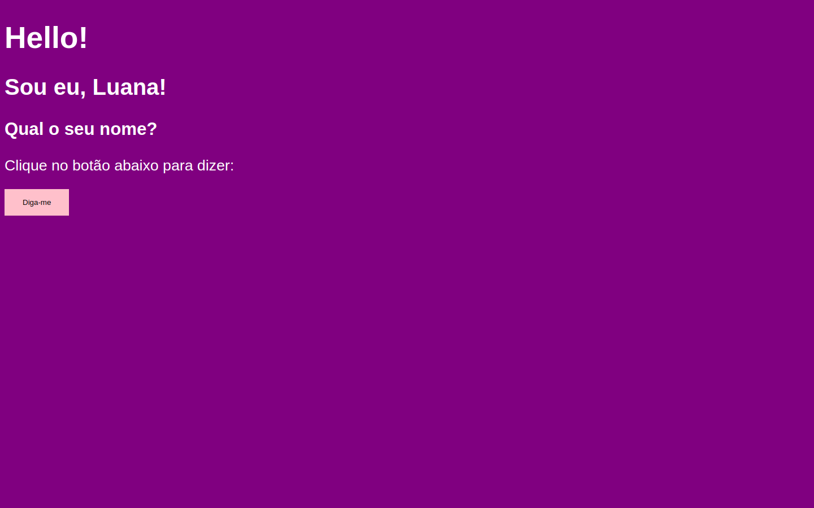
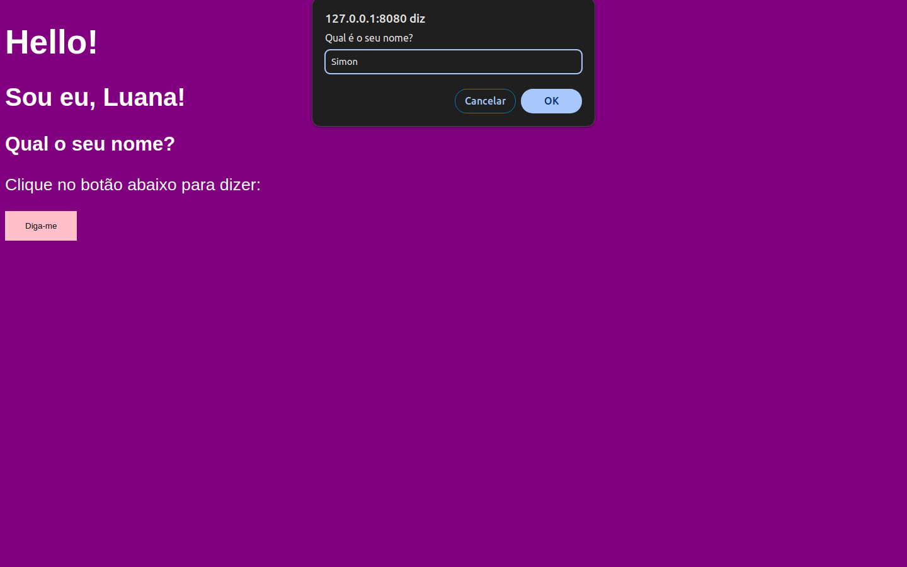
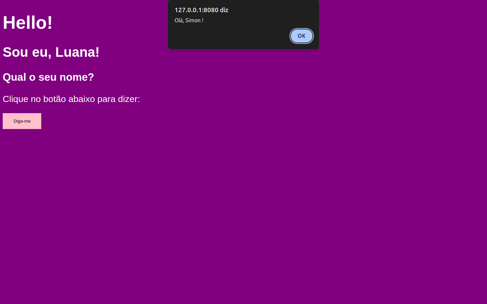

# Atividade 01

Criar a sua primeira página com interação.

## Tarefas

1. [ ] Criar pasta Atividades (comando `mkdir`)
2. [ ] Criar pasta "atividade-01" dentro da pasta "atividades"
3. [ ] Criar arquivo "index.html" dentro da pasta atividade-01 (comando `New-Item -Path "./index.html" -ItemType File`)
4. [ ] Abrir arquivo com o editor (`nvim nome do arquivo` ou `nvim .`)
5. [ ] Adicionar o título a sua página (tag `<title>`)
6. [ ] Adicionar os elementos no corpo (`<body>`) da sua página (o `h1`, o `h2`, o `h3` e o botão `button`)
7. [ ] Estilizar os elementos adicionsados: copie o código nas referências e cole o na tag `style` e altere conforme seu gosto.
8. [ ] Adicione o código da referência ao seu `script`.
9. [ ] Linke a função do seu código com o botão conforme diz no link da referência.
10. [ ] Compare com o [gabarito](./index.html)

## Resultado esperado

- Design da página:
  

- Prompt perguntando o nome:
  

- Alerta dizendo olá para o nome:
  

## Referências

Aqui está onde você lerá sobre como fazer:

- Aqui você lerá sobre [a tag button](https://www.w3schools.com/tags/tag_button.asp) e verá como ela funciona e como colocá-la.
- [Aqui](https://www.w3schools.com/tags/ev_onclick.asp) você lerá sobre como colocar a função abaixo no botão que você vai adicionar.

```javascript
// Essa função deve ser copiada e colada dentro da tag <script></script> no seu HTML.
function whatYourName() {
  let name = window.prompt("Qual é o seu nome?");

  window.alert("Olá, " + name + " !");
}
```

- Se você quiser pode ver [aqui](https://www.w3schools.com/css/default.asp), como estilizar a sua página. Copie o código abaixo e altee as cores ao seu gosto.

```css
body {
  background-color: purple;
  color: white;
  font: normal 20pt Arial;
}
button {
  background-color: pink;
  color: black;
  border: none;
  padding: 16px 32px;
  cursor: pointer;
}
```
