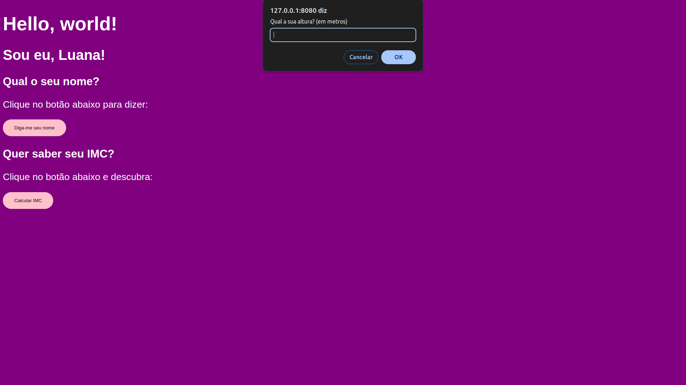
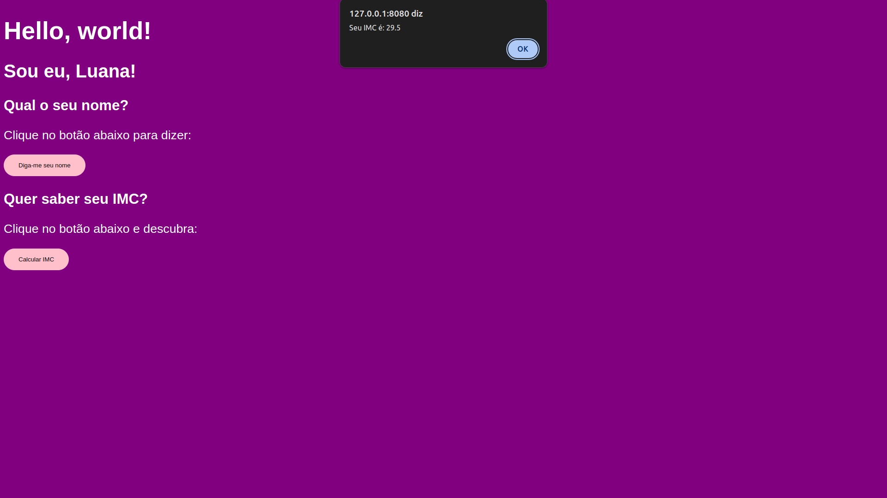

# Atividade 02

Agora seu site irá calcular o IMC.

## Tarefas

1. [ ] Criar pasta Atividades (comando `mkdir`)
2. [ ] Criar pasta "atividade-02" dentro da pasta "atividades"
3. [ ] Criar arquivo "index.html" dentro da pasta atividade-02 (comando `New-Item -Path "./index.html" -ItemType File`)
4. [ ] Abrir arquivo com o editor (`nvim nome do arquivo` ou `nvim .`)
5. [ ] Adicionar o título a sua página (tag `<title>`)
6. [ ] Adicionar os elementos no corpo (`<body>`) da sua página (o `h1`, o `h2`, o `h3` e o botão `button`)
7. [ ] Estilizar os elementos adicionados: copie o código nas referências e cole o na tag `style` e altere conforme seu gosto.
8. [ ] Adicione o código da referência ao seu `script`.
9. [ ] Linke a função do seu código com o botão conforme diz no link da referência.
10. [ ] Compare com o [gabarito](./index.html)

## Resultado esperado

- Design da página:
  

- Prompt perguntando a altura:
  

- Prompt perguntando o peso:
  

- Alerta dizendo o IMC para o usuário:
  

## Referências

Aqui está onde você lerá sobre como fazer:

- Aqui você lerá sobre [a tag button](https://www.w3schools.com/tags/tag_button.asp) e verá como ela funciona e como colocá-la.
- [Aqui](https://www.w3schools.com/tags/ev_onclick.asp) você lerá sobre como colocar a função abaixo no botão que você vai adicionar.
- [Aqui](https://www.w3schools.com/js/js_let.asp) você lerá sobre o `let` que aparece no `script` .
- [Aqui](https://www.w3schools.com/js/js_functions.asp) você aprenderá como são as funções em Javascript.
- [Aqui](https://www.w3schools.com/js/js_operators.asp) você aprenderá sobre os operadores e como fazer as operações com as variáveis e entenderá como foi feita a operação para calcular o IMC.

## Scripts

- Função pro botão do Qual o seu nome

```javascript
// Essa função deve ser copiada e colada dentro da tag <script></script> no seu HTML.
function whatYourName() {
  let name = window.prompt("Qual é o seu nome?");

  window.alert("Olá, " + name + " !");
}
```

- Função do botão do IMC:

```javascript
// função que pega a altura e o peso, calcula o IMC e imprime na tela via alert
function whatYourIMC() {
  let height = window.prompt("Qual a sua altura? (em metros)");
  let weight = window.prompt("Qual o seu peso? (em kg)");

  let imc = weight / (height ^ 2);

  window.alert(`Seu IMC é: ${imc}`);
}
```

- Se você quiser pode ver [aqui](https://www.w3schools.com/css/default.asp), como estilizar a sua página. Copie o código abaixo e altere as cores ao seu gosto.

```css
body {
  background-color: purple;
  color: white;
  font: normal 20pt Arial;
}
button {
  background-color: pink;
  color: black;
  border: none;
  padding: 16px 32px;
  cursor: pointer;
}
```
